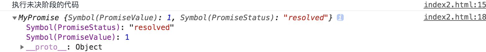
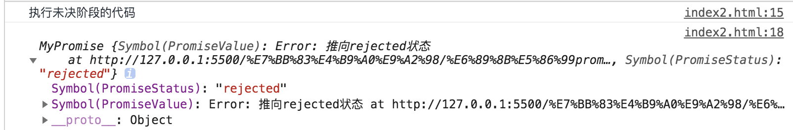
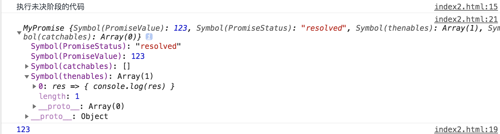

## 未决阶段推向已决阶段
Promise是一个构造函数，接收一个函数，函数有两个参数（resolve,reject），也是两个函数。resolve 和 reject 作用就是调用的时候是把未决阶段推向已决，也就是改变promise的状态，并且附上返回值。
```js
const pro = new MyPromise((resolve, reject) => {
  console.log('执行未决阶段的代码')
  resolve(1)
})
console.log(pro) 
```

```js
//写成立即执行函数，设置私有变量。
const MyPromise = (() => {
  const PENDING = 'pending',    //状态设置为常量
        RESOLVED = 'resolved',
        REJECTED = 'rejected',
        //设置为symbol，不让外界调用
        PromiseValue = Symbol('PromiseValue'), //状态数据
        PromiseStatus = Symbol('PromiseStatus') //当前状态

  return class MyPromise {
    constructor(executor) {  //executor为传入的函数
      //初始化数据
      this[PromiseValue] = undefined  
      this[PromiseStatus] = PENDING 

      //resolve调用就两个作用：改变状态，设置返回值
      const resolve = data => {   //写成箭头函数，避免this的问题
        //如果当前的状态不是pending，就直接return。（promise只要状态是已决，就不能再改变）
        if(this[PromiseStatus] !== PENDING) {
          return
        }
        this[PromiseValue] = data   //设置数据
        this[PromiseStatus] = RESOLVED  //改变状态
      }

      //reject跟resolve一样
      const reject = reason => {  
        if(this[PromiseStatus] !== PENDING) {
          return
        }
        this[PromiseValue] = reason
        this[PromiseStatus] = REJECTED
      }

      //executor在初始化的时候调用了一次
      executor(resolve, reject) //带有两个参数，我们自己定义这两个参数
     
    }   
  }
})()
```
```js
//上面的代码有重复的部分，我们先优化一下 ---优化后
const MyPromise = (() => {
  const PENDING = 'pending',    //状态设置为常量
        RESOLVED = 'resolved',
        REJECTED = 'rejected',
        PromiseValue = Symbol('PromiseValue'), //状态数据
        PromiseStatus = Symbol('PromiseStatus'), //当前状态
        changeStatus = Symbol('changeStatus') //改变状态

  return class MyPromise {
    //公共函数
    //改变状态： newStatus：将要改变的状态，newValue：要改变的状态数据
    [changeStatus](newStatus, newValue) {
       if(this[PromiseStatus] !== PENDING) {
          return
        }
        this[PromiseStatus] = newStatus
        this[PromiseValue] = newValue
    }

    constructor(executor) {  //executor为传入的函数
      //初始化数据
      this[PromiseValue] = undefined  
      this[PromiseStatus] = PENDING 

      //抽取了跟reject的公共代码。
      const resolve = data => {  
        this[changeStatus](RESOLVED, data) 
      }
      const reject = reason => {  
        this[changeStatus](REJECTED, reason) 
      }
      //executor在初始化的时候调用了一次
      executor(resolve, reject) //带有两个参数，我们自己定义这两个参数
     
    }   
  }
})()
```

## 解决throw问题
除了reject函数可以把未决阶段推向rejected状态，throw也可以。
```js
const pro = new MyPromise((resolve, reject) => {
  console.log('执行未决阶段的代码')
  throw new Error('推向rejected状态')
})
console.log(pro)
```

```js
const MyPromise = (() => {
  const PENDING = 'pending',    //状态设置为常量
        RESOLVED = 'resolved',
        REJECTED = 'rejected',
        PromiseValue = Symbol('PromiseValue'), //状态数据
        PromiseStatus = Symbol('PromiseStatus'), //当前状态
        changeStatus = Symbol('changeStatus') //改变状态

  return class MyPromise {
    [changeStatus](newStatus, newValue) {
       if(this[PromiseStatus] !== PENDING) {
          return
        }
        this[PromiseStatus] = newStatus
        this[PromiseValue] = newValue
    }

    constructor(executor) {  //executor为传入的函数
      //初始化数据
      this[PromiseValue] = undefined  
      this[PromiseStatus] = PENDING 

      //抽取了跟reject的公共代码。
      const resolve = data => {  
        this[changeStatus](RESOLVED, data) 
      }
      const reject = reason => {  
        this[changeStatus](REJECTED, reason) 
      }
      //executor在初始化的时候调用了一次
      //如果传入的是一个throw 'xxx'
      try{
        executor(resolve, reject) //带有两个参数，我们自己定义这两个参数
      }
      catch(err) {
        reject(err)  //在这里捕获
      }
    }   
  }
})()
```

## 处理then和catch
考虑两个问题：
  1. 什么时候往事件队列里面加处理函数？
  如果当前状态已经到达已决，执行处理函数，否则，把处理函数加入消息队列。
  2. 什么时候执行事件队列里面的处理函数？
  当状态改变的时候。

解决第一个问题：什么时候往事件队列里面加处理函数？
```js
const pro = new MyPromise((resolve, reject) => {
  console.log('执行未决阶段的代码')
  resolve(23)
})
//同步，当前状态到达已决
pro.then(res => {
  console.log(res)
})
console.log(pro)
```

```js
const MyPromise = (() => {
  const PENDING = 'pending',    //状态设置为常量
        RESOLVED = 'resolved',
        REJECTED = 'rejected',
        PromiseValue = Symbol('PromiseValue'), //状态数据
        PromiseStatus = Symbol('PromiseStatus'), //当前状态
        changeStatus = Symbol('changeStatus'), //改变状态
        //新增
        thenables = Symbol('thenables'), //resolve的消息队列
        catchables = Symbol('catchables') //rejecte的消息队列

  return class MyPromise {
    //公共函数
    //改变状态： newStatus：将要改变的状态，newValue：要改变的状态数据
    [changeStatus](newStatus, newValue) {
       if(this[PromiseStatus] !== PENDING) {
          return
        }
        this[PromiseStatus] = newStatus
        this[PromiseValue] = newValue
    }

    constructor(executor) {  //executor为传入的函数
      this[PromiseValue] = undefined  
      this[PromiseStatus] = PENDING 
      //新增
      //初始化队列
      this[thenables] = []
      this[catchables] = []

      const resolve = data => {  
        this[changeStatus](RESOLVED, data) 
      }
      const reject = reason => {  
        this[changeStatus](REJECTED, reason) 
      }
      try{
        executor(resolve, reject) //带有两个参数，我们自己定义这两个参数
      }
      catch(err) {
        reject(err)  //在这里捕获
      }
    }  

    //then函数，接收两个处理函数(resolved和rejected两个状态的)
    then(thenable, catchable) {
      //如果当前状态是resolved,表示已经到达已决状态，用setTimeout模拟进入微队列。因为微队列是底层实现的，所以虽然setTimeout是宏队列，也只能用这个模拟。
      if(this[PromiseStatus] === RESOLVED) {
        setTimeout(() => {
          thenable(this[PromiseValue])
        }, 0)
      }else {
        //否则把处理函数加入resolve的消息队列
        this[thenables].push(thenable)
      }
      //rejected状态则调用catch
      this.catch(catchable)
    } 
    //同上
    catch(catchable) {
      if(this[PromiseStatus] === REJECTED) {
        setTimeout(() => {
          catchable(this[PromiseValue])
        }, 0)
      }else {
        this[catchables].push(catchable)
      }
    }
  }
})()
```
```js
//优化代码
const MyPromise = (() => {
  const PENDING = 'pending',    //状态设置为常量
        RESOLVED = 'resolved',
        REJECTED = 'rejected',
        PromiseValue = Symbol('PromiseValue'), //状态数据
        PromiseStatus = Symbol('PromiseStatus'), //当前状态
        changeStatus = Symbol('changeStatus'), //改变状态
        thenables = Symbol('thenables'), //resolve的消息队列
        catchables = Symbol('catchables'), //rejecte的消息队列
        //新增
        settleHandler = Symbol('settleHandler') //后续处理通用函数

  return class MyPromise {
    //公共函数
    //改变状态： newStatus：将要改变的状态，newValue：要改变的状态数据
    [changeStatus](newStatus, newValue) {
       if(this[PromiseStatus] !== PENDING) {
          return
        }
        this[PromiseStatus] = newStatus
        this[PromiseValue] = newValue
    }

    constructor(executor) {  //executor为传入的函数
      this[PromiseValue] = undefined  
      this[PromiseStatus] = PENDING 
      //初始化队列
      this[thenables] = []
      this[catchables] = []

      const resolve = data => {  
        this[changeStatus](RESOLVED, data) 
      }
      const reject = reason => {  
        this[changeStatus](REJECTED, reason) 
      }
      try{
        executor(resolve, reject) //带有两个参数，我们自己定义这两个参数
      }
      catch(err) {
        reject(err)  //在这里捕获
      }
    }  
    //新增
    //后续处理通用函数
    //handler: 要调用的处理函数
    //immediatelyStatus： 需要立即执行的状态
    //queue: 要加入的队列
    [settleHandler](handler, immediatelyStatus, queue) {
      if(this[PromiseStatus] === immediatelyStatus) {
        setTimeout(() => {
          handler(this[PromiseValue])
        }, 0)
      }else {
        //否则把处理函数加入resolve的消息队列
        queue.push(handler)
      }
    }

    then(thenable, catchable) {
      //提取出了公共函数
      this[settleHandler](thenable, RESOLVED, this[thenables])
      this.catch(catchable)
    } 
    catch(catchable) {
     this[settleHandler](catchable, REJECTED, this[catchables])
    }
  }
})()
```
解决第二个问题：什么时候执行事件队列里面的处理函数？
```js
const MyPromise = (() => {
  const PENDING = 'pending',    //状态设置为常量
        RESOLVED = 'resolved',
        REJECTED = 'rejected',
        PromiseValue = Symbol('PromiseValue'), //状态数据
        PromiseStatus = Symbol('PromiseStatus'), //当前状态
        changeStatus = Symbol('changeStatus'), //改变状态
        thenables = Symbol('thenables'), //resolve的消息队列
        catchables = Symbol('catchables'), //rejecte的消息队列
        settleHandler = Symbol('settleHandler') //后续处理通用函数

  return class MyPromise {
    //新增  加一个队列参数，当状态改变的时候，执行队列中的处理函数
    //公共函数
    //改变状态： newStatus：将要改变的状态，newValue：要改变的状态数据
    [changeStatus](newStatus, newValue, queue) {
       if(this[PromiseStatus] !== PENDING) {
          return
        }
        this[PromiseStatus] = newStatus
        this[PromiseValue] = newValue
        queue.forEach(handler => handler(newValue))
    }

    constructor(executor) {  //executor为传入的函数
      this[PromiseValue] = undefined  
      this[PromiseStatus] = PENDING 
      //初始化队列
      this[thenables] = []
      this[catchables] = []
      //新增参数，resolve的消息队列
      const resolve = data => {  
        this[changeStatus](RESOLVED, data, this[thenables]) 
      }
       //新增参数，reject的消息队列
      const reject = reason => {  
        this[changeStatus](REJECTED, reason, this[catchables]) 
      }
      try{
        executor(resolve, reject) //带有两个参数，我们自己定义这两个参数
      }
      catch(err) {
        reject(err)  //在这里捕获
      }
    }  
    
    //后续处理通用函数
    //handler: 要调用的处理函数
    //immediatelyStatus： 需要立即执行的状态
    //queue: 要加入的队列
    [settleHandler](handler, immediatelyStatus, queue) {
      //新增：如果传入的处理函数不是function类型的，则直接返回
      if(typeof handler !== 'function') {
        return
      }

      if(this[PromiseStatus] === immediatelyStatus) {
        setTimeout(() => {
          handler(this[PromiseValue])
        }, 0)
      }else {
        //否则把处理函数加入resolve的消息队列
        queue.push(handler)
      }
    }

    then(thenable, catchable) {
      this[settleHandler](thenable, RESOLVED, this[thenables])
      this.catch(catchable)
    } 
    catch(catchable) {
     this[settleHandler](catchable, REJECTED, this[catchables])
    }
  }
})()
```

## 链式调用（串联）
```js
 const pro = new MyPromise((resolve, reject) => {
    console.log('执行未决阶段的代码')
    resolve(123)
  })

  pro.then(res => {
    console.log(1, res)
    return 456
  }).then(res => {
    return new MyPromise((resolve, reject) => {
      console.log(2,res)
      resolve(666)
    })
  }).then(res => {
    console.log(3,res)
  }) //1 123  2 456 3 666
```
```js
const MyPromise = (() => {
  const PENDING = 'pending',    //状态设置为常量
        RESOLVED = 'resolved',
        REJECTED = 'rejected',
        PromiseValue = Symbol('PromiseValue'), //状态数据
        PromiseStatus = Symbol('PromiseStatus'), //当前状态
        changeStatus = Symbol('changeStatus'), //改变状态
        thenables = Symbol('thenables'), //resolve的消息队列
        catchables = Symbol('catchables'), //rejecte的消息队列
        settleHandler = Symbol('settleHandler'), //后续处理通用函数
        //新增
        linkPromise = Symbol('linkPromise')  //串联时候创建一个新的Promise

  return class MyPromise {
    //公共函数
    //改变状态： newStatus：将要改变的状态，newValue：要改变的状态数据
    [changeStatus](newStatus, newValue, queue) {
       if(this[PromiseStatus] !== PENDING) {
          return
        }
        this[PromiseStatus] = newStatus
        this[PromiseValue] = newValue
        queue.forEach(handler => handler(newValue))
    }

    constructor(executor) {  //executor为传入的函数
      this[PromiseValue] = undefined  
      this[PromiseStatus] = PENDING 
      this[thenables] = []
      this[catchables] = []

      const resolve = data => {  
        this[changeStatus](RESOLVED, data, this[thenables]) 
      }
      const reject = reason => {  
        this[changeStatus](REJECTED, reason, this[catchables]) 
      }
      try{
        executor(resolve, reject) //带有两个参数，我们自己定义这两个参数
      }
      catch(err) {
        reject(err)  //在这里捕获
      }
    }  
    
    //后续处理通用函数
    //handler: 要调用的处理函数
    //immediatelyStatus： 需要立即执行的状态
    //queue: 要加入的队列
    [settleHandler](handler, immediatelyStatus, queue) {
      if(typeof handler !== 'function') {
        return
      }
      if(this[PromiseStatus] === immediatelyStatus) {
        setTimeout(() => {
          handler(this[PromiseValue])
        }, 0)
      }else {
        //否则把处理函数加入resolve的消息队列
        queue.push(handler)
      }
    }

    //当then返回一个promise时
    //返回的promise的状态和状态数据都是由之前的promise决定的，所以要从之前的处理函数中得到状态数据,所以then中的处理函数要放到这个函数中执行
    [linkPromise](thenable, catchable) {
      return new MyPromise((resolve, reject) => {
        // this[settleHandler](thenable, RESOLVED, this[thenables])
        //返回的状态数据由thenable的返回值决定，所以要拿到thenable的返回值
        this[settleHandler](data => {       //相当于把thenable展开
         
          try{
            const result = thenable(data)     //当前promise的返回值
            resolve(result)       
          }
          catch(err) {                      //执行过程中出现问题，标记为reject
            reject(err)
          }

        }, RESOLVED, this[thenables])

         this[settleHandler](reason => {     
          
          try{
            const result = catchable(reason)
            resolve(result)  
          }
          catch(err) {
            reject(err)
          }
                          
        }, REJECTED, this[catchables])
      })
    }

    then(thenable, catchable) {
      return this[linkPromise](thenable, catchable)
    } 
    catch(catchable) {
      return this[linkPromise](undefined, catchable)
    }
  }
})()
```
```js
//优化
const MyPromise = (() => {
  const PENDING = 'pending',    //状态设置为常量
        RESOLVED = 'resolved',
        REJECTED = 'rejected',
        PromiseValue = Symbol('PromiseValue'), //状态数据
        PromiseStatus = Symbol('PromiseStatus'), //当前状态
        changeStatus = Symbol('changeStatus'), //改变状态
        thenables = Symbol('thenables'), //resolve的消息队列
        catchables = Symbol('catchables'), //rejecte的消息队列
        settleHandler = Symbol('settleHandler'), //后续处理通用函数
        linkPromise = Symbol('linkPromise')  //串联时候创建一个新的Promise

  return class MyPromise {
    //公共函数
    //改变状态： newStatus：将要改变的状态，newValue：要改变的状态数据
    [changeStatus](newStatus, newValue, queue) {
       if(this[PromiseStatus] !== PENDING) {
          return
        }
        this[PromiseStatus] = newStatus
        this[PromiseValue] = newValue
        queue.forEach(handler => handler(newValue))
    }

    constructor(executor) {  //executor为传入的函数
      this[PromiseValue] = undefined  
      this[PromiseStatus] = PENDING 
      this[thenables] = []
      this[catchables] = []

      const resolve = data => {  
        this[changeStatus](RESOLVED, data, this[thenables]) 
      }
      const reject = reason => {  
        this[changeStatus](REJECTED, reason, this[catchables]) 
      }
      try{
        executor(resolve, reject) //带有两个参数，我们自己定义这两个参数
      }
      catch(err) {
        reject(err)  //在这里捕获
      }
    }  
    
    //后续处理通用函数
    //handler: 要调用的处理函数
    //immediatelyStatus： 需要立即执行的状态
    //queue: 要加入的队列
    [settleHandler](handler, immediatelyStatus, queue) {
      if(typeof handler !== 'function') {
        return
      }
      if(this[PromiseStatus] === immediatelyStatus) {
        setTimeout(() => {
          handler(this[PromiseValue])
        }, 0)
      }else {
        //否则把处理函数加入resolve的消息队列
        queue.push(handler)
      }
    }

    //当then返回一个promise时
    //返回的promise的状态和状态数据都是由之前的promise决定的，所以要从之前的处理函数中得到状态数据,所以then中的处理函数要放到这个函数中执行
    [linkPromise](thenable, catchable) {
      //提起公共函数
      function exec(data, handler, resolve, reject) {
         try{
           //如果得到的result是一个promise
            const result = handler(data) 
            if(result instanceof MyPromise) {
              //则执行这个promise
              result.then(res => {
                //得到结果后一样执行resolve
                resolve(res)       
              },err => {
                reject(err)
              })
            }else {
              resolve(result)
            }   
          }
          catch(err) {                     
            reject(err)
          }
      }
      return new MyPromise((resolve, reject) => {
        // this[settleHandler](thenable, RESOLVED, this[thenables])
        //返回的状态数据由thenable的返回值决定，所以要拿到thenable的返回值
        this[settleHandler](data => {       //相当于把thenable展开
          exec(data, thenable, resolve, reject)         
        }, RESOLVED, this[thenables])

         this[settleHandler](reason => {     
           exec(reason, catchable, resolve, reject)    
        }, REJECTED, this[catchables])
      })
    }

    then(thenable, catchable) {
      return this[linkPromise](thenable, catchable)
    } 
    catch(catchable) {
      return this[linkPromise](undefined, catchable)
    }
  }
})()
```

## Promise的几个静态方法
### resolve
```js
const pro = MyPromise.resolve(123)
console.log(pro)
```
```js
//如果传入的是一个promise对象，直接返回
//传入的是一个数据，则调用promise的resolve方法
static resolve(data) {
  if(typeof data === MyPromise) {
    return data
  }else {
    return new MyPromise((resolve, reject) => {
      resolve(data)
    })
  }
}
```
### reject
```js
const pro = MyPromise.reject(123)
console.log(pro)
```
```js
//reject则直接返回reject方法
static reject(reason) {
  return new MyPromise((resolve, reject) => {
    reject(reason)
  })
}
```
### all
```js
function getRandom(min, max) {
  return Math.floor(Math.random() * (max - min)) + min;
}
const proms = [];
for (let i = 0; i < 10; i++) {
  proms.push(new MyPromise((resolve, reject) => {
    setTimeout(() => {
      console.log(i, "完成");
      resolve(i)
        // if (Math.random() < 0.5) {
        //   console.log(i, "完成");
        //   resolve(i);
        // } 
        // else {
        //     console.log(i, "失败")
        //     reject(i);
        // }
    }, getRandom(1000, 5000));
  }))
}
//等到所有的promise变成resolved状态后输出: 全部完成
const pro = MyPromise.all(proms)
pro.then(datas => {
  console.log("全部完成", datas);
})
pro.catch(err => {
  console.log("有失败的", err);
})
console.log(proms);
```
```js
//当所有的promise完成之后返回一个新的promise
//什么时候所有的promise全部完成呢？
static all(proms) {
  return new MyPromise((resolve, reject) => {
    //先把proms映射成一个新的数组，包含每一个promise的结果和是否到达resolve状态
    const results = proms.map(p => {
      const obj = {
        result: undefined,    //初始
        isResolved: false
      }
      //什么时候改变状态呢？ 当执行then的时候
      p.then(res => {
        obj.result = res;
        obj.isResolved = true
        //什么全部promise都执行完呢，当数组里面的isResolved全部改成true的时候
        //把results里面isResolved为false的放入一个新的数组
        const hasUnResolved = results.filter(it => !it.isResolved)
        if(hasUnResolved.length === 0) {
          //全部完成。可以resolve结果出去。把results重新映射成只有result结果的数组。
          resolve(results.map(it => it.result))
        }
      },err => {
        //如果有一个失败，则直接reject
        reject(err)
      })
      return obj
    })
  })
}
```
### race

```js
function getRandom(min, max) {
  return Math.floor(Math.random() * (max - min)) + min;
}
const proms = [];
for (let i = 0; i < 10; i++) {
  proms.push(new MyPromise((resolve, reject) => {
      setTimeout(() => {
          if (Math.random() < 0.5) {
              console.log(i, "完成");
              resolve(i);
          } else {
              console.log(i, "失败")
              reject(i);
          }
      }, getRandom(1000, 5000));
  }))
}
//等到所有的promise变成resolved状态后输出: 全部完成
const pro = MyPromise.race(proms)
pro.then(datas => {
  console.log("有一个完成", datas);
})
pro.catch(err => {
  console.log("有一个失败", err);
})
console.log(proms);
```
```js
static race(proms) {
  return new MyPromise((resolve, reject) => {
    //遍历proms，只要有一个状态到达resolve则resolve结果
    proms.forEach(result => {
      result.then(res => {
        resolve(res)
      },err => {
        reject(err)
      })
    })
  })
}
```


## 完整代码
```js
const MyPromise = (() => {
  const PENDING = 'pending',    //状态设置为常量
        RESOLVED = 'resolved',
        REJECTED = 'rejected',
        PromiseValue = Symbol('PromiseValue'), //状态数据
        PromiseStatus = Symbol('PromiseStatus'), //当前状态
        changeStatus = Symbol('changeStatus'), //改变状态
        thenables = Symbol('thenables'), //resolve的消息队列
        catchables = Symbol('catchables'), //rejecte的消息队列
        settleHandler = Symbol('settleHandler'), //后续处理通用函数
        linkPromise = Symbol('linkPromise')  //串联时候创建一个新的Promise

  return class MyPromise {
    //公共函数
    //改变状态： newStatus：将要改变的状态，newValue：要改变的状态数据
    [changeStatus](newStatus, newValue, queue) {
       if(this[PromiseStatus] !== PENDING) {
          return
        }
        this[PromiseStatus] = newStatus
        this[PromiseValue] = newValue
        queue.forEach(handler => handler(newValue))
    }

    constructor(executor) {  //executor为传入的函数
      this[PromiseValue] = undefined  
      this[PromiseStatus] = PENDING 
      this[thenables] = []
      this[catchables] = []

      const resolve = data => {  
        this[changeStatus](RESOLVED, data, this[thenables]) 
      }
      const reject = reason => {  
        this[changeStatus](REJECTED, reason, this[catchables]) 
      }
      try{
        executor(resolve, reject) //带有两个参数，我们自己定义这两个参数
      }
      catch(err) {
        reject(err)  //在这里捕获
      }
    }  
    
    //后续处理通用函数
    //handler: 要调用的处理函数
    //immediatelyStatus： 需要立即执行的状态
    //queue: 要加入的队列
    [settleHandler](handler, immediatelyStatus, queue) {
      if(typeof handler !== 'function') {
        return
      }
      if(this[PromiseStatus] === immediatelyStatus) {
        setTimeout(() => {
          handler(this[PromiseValue])
        }, 0)
      }else {
        //否则把处理函数加入resolve的消息队列
        queue.push(handler)
      }
    }

    //当then返回一个promise时
    //返回的promise的状态和状态数据都是由之前的promise决定的，所以要从之前的处理函数中得到状态数据,所以then中的处理函数要放到这个函数中执行
    [linkPromise](thenable, catchable) {
      //提起公共函数
      function exec(data, handler, resolve, reject) {
         try{
           //如果得到的result是一个promise
            const result = handler(data) 
            if(result instanceof MyPromise) {
              //则执行这个promise
              result.then(res => {
                //得到结果后一样执行resolve
                resolve(res)       
              },err => {
                reject(err)
              })
            }else {
              resolve(result)
            }   
          }
          catch(err) {                     
            reject(err)
          }
      }
      return new MyPromise((resolve, reject) => {
        // this[settleHandler](thenable, RESOLVED, this[thenables])
        //返回的状态数据由thenable的返回值决定，所以要拿到thenable的返回值
        this[settleHandler](data => {       //相当于把thenable展开
          exec(data, thenable, resolve, reject)         
        }, RESOLVED, this[thenables])

         this[settleHandler](reason => {     
           exec(reason, catchable, resolve, reject)    
        }, REJECTED, this[catchables])
      })
    }

    then(thenable, catchable) {
      return this[linkPromise](thenable, catchable)
    } 
    catch(catchable) {
      return this[linkPromise](undefined, catchable)
    }

    static resolve(data) {
      if(typeof data === MyPromise) {
        return data
      }else {
        return new MyPromise((resolve, reject) => {
          resolve(data)
        })
      }
    }

    static reject(reason) {
      return new MyPromise((resolve, reject) => {
        reject(reason)
      })
    }

    static all(proms) {
      return new MyPromise((resolve, reject) => {
        //先把proms映射成一个新的数组，包含每一个promise的结果和是否到达resolve状态
        const results = proms.map(p => {
          const obj = {
            result: undefined,    //初始
            isResolved: false
          }
          //什么时候改变状态呢？ 当执行then的时候
          p.then(res => {
            obj.result = res;
            obj.isResolved = true
            //什么全部promise都执行完呢，当数组里面的isResolved全部改成true的时候
            //把results里面isResolved为false的放入一个新的数组
            const hasUnResolved = results.filter(it => !it.isResolved)
            if(hasUnResolved.length === 0) {
              //全部完成。可以resolve结果出去。把results重新映射成只有result结果的数组。
              resolve(results.map(it => it.result))
            }
          },err => {
            //如果有一个失败，则直接reject
            reject(err)
          })
          return obj
        })
      })
    }
    
    static race(proms) {
      return new MyPromise((resolve, reject) => {
        //遍历proms，只要有一个状态到达resolve则resolve结果
        proms.forEach(result => {
          result.then(res => {
            resolve(res)
          },err => {
            reject(err)
          })
        })
      })
    }
  }
})()
```


