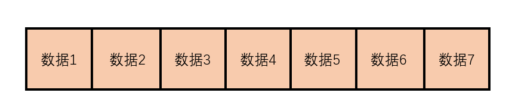
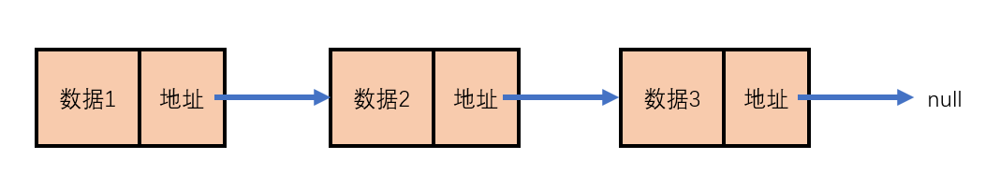

**线性结构**

线性结构是数据结构中的一种分类，用于表示一系列的元素形成的有序集合。

常见的线性结构包括：**数组、链表、栈、队列**

## 数组

> 特别注意：这里所说的数组是数据结构中的数组，和JS中的数组不一样。js原本的数组底层是用链表来实现的，在经过v8引擎后，v8引擎上的js的数组也等于数据结构中的数组

**数组是一整块连续的内存空间，它由固定数量的元素组成，数组具有以下基本特征：**

1. 整个数组占用的内存空间是连续的
2. 数组中元素的数量是固定的（不可增加也不可减少），创建数组时就必须指定其长度
3. 每个元素占用的内存大小是完全一样的




根据数组的基本特征，我们可以推导出数组具有以下特点：

1. 通过下标寻找对应的元素效率极高，因此遍历速度快（只需要通过运算就可以得到下一个元素）
2. 无法添加和删除数据，虽然可以通过某种算法完成类似操作，但会增加额外的内存开销或时间开销
3. 如果数组需要的空间很大，可能一时无法找到足够大的**连续内存**

## 链表

为弥补数组的缺陷而出现的一种数据结构，它具有以下基本特征：

1. 每个元素除了存储数据，需要有额外的内存存储一个引用（地址），来指向下一个元素
2. 每个元素占用的内存空间并不要求是连续的
3. 往往使用链表的第一个节点（根节点）来代表整个链表



根据链表的基本特征，我们可以推导出它具有以下特点：

1. 长度是可变的，随时可以增加和删除元素
2. 插入和删除元素的效率极高
3. 由于要存储下一个元素的地址，会增加额外的内存开销
4. 通过下标查询链表中的某个节点，效率很低，因此链表的下标遍历效率低（下标获取元素，都是需要从头开始获取: a[3] -> a[0] a[1] a[2] -> a[3]）

### 手动用代码实现链表
手写一个链表结构，并完成一些链表的相关函数。

```js
/**
 * 构造函数：能构造出节点(每个节点可以代表一个链表)
 * @param {*} value 
 */
function Node(value) {
  this.value = value
  this.next = null  //内存地址，用于指向下一个节点
}

const a = new Node('a')
const b = new Node('b')
const c = new Node('c')

a.next = b
b.next = c  //构建出一个简单的链表，a节点是根节点，可以表示整个链表

// console.log(a)
```
1. 遍历打印
```js
/**
 * 遍历打印出整个链表
 * @param {*} root 一个节点
 */
//分治法，把一个整体分成一个小部分加另一个整体，先完成小部分的运算。
function print(root) {
  if(!root) return          
  console.log(root.value)
  print(root.next)
}
//穷举法，把所有的都遍历一遍
function print (root) {
  while(root) {      
    console.log(root.value)
    root = root.next
  }
}

// print(a)
```
2. 获取链表的长度
```js
/**
 * 获取链表的长度
 * @param {*} root 
 */
function count(root) {
  if(!root) return 0
  return count(root.next) + 1
}

// const result = count(a)
// console.log(result)
```
3. 通过下标获取链表中的某个数据
```js
/**
 *  通过下标获取链表中的某个数据
 * @param {*} root 
 * @param {*} index 
 */
function getNode(root, index) {
  //当需要一个这个函数作用域的通用变量时，写一个辅助函数
  //i ：当i等于要找的下标的时候，它的值就是要找的值
  function _getNode(node, i) {
    if (!node) return
    if (i === index) return node
    return _getNode(node.next, i + 1)
  }
  //i从0开始
  return _getNode(root, 0)
}

// const result = getNode(a, 2)
// console.log(result)
```
4. 通过下标设置链表中的某个数据
```js
/**
 * 通过下标设置链表中的某个数据
 * @param {*} root 
 * @param {*} index 
 * @param {*} newValue 
 */
function setValue(root, index, newValue) {
  function _setValue(node, i) {
    if (!node) return
    if (i === index) {
      node.value = newValue
    }
    else {
      return _setValue(node.next, i + 1)
    }
  }
  return _setValue(root, 0)
}
setValue(a, 2, 'k')
print(a)
```
5. 在链表某一个节点之后加入一个新节点
```js
/**
 * 在链表某一个节点之后加入一个新节点
 * @param {*} root 
 * @param {*} newValue 
 */
function insertAfter(root, newValue) {
  if(!root) return
  //新构建一个节点
  const newNode = new Node(newValue)
  newNode.next = root.next
  root.next = newNode
}

// insertAfter(c, 'a')
// print(a)
```
6. 在链表末尾加入一个新节点
```js
/**
 * 在链表末尾加入一个新节点
 */
function pushNode(root, newValue) {
  if (!root) return
  //判断是不是最后一个节点
  if (!root.next) {
    const newNode = new Node(newValue)
    root.next = newNode
  }
  else {
    pushNode(root.next, newValue)
  }
}

// pushNode(a, 'll')
// pushNode(a, 'llaa')
// print(a)
```
7. 删除一个链表节点
```js
/**
 * 删除一个链表节点
 */
function removeNode (root, value) {
  //如果节点没有下一个，也返回
  if(!root || !root.next) return
  if(root.next.value === value) {
    root.next = root.next.next
  }
  else {
    removeNode(root.next, value)
  }
}

// removeNode(b, 'c')
// print(a)
```
8. 链表倒序
```js
/**
 * 链表倒序
 */
function reverse(root) {
  if (!root || !root.next) return
  //考虑两个节点的情况 
  //a.next = b -> b.next = null
  //要更改为a.next = null b.next = a 同时把b当作根节点返回出去
  if (!root.next.next) {
    //保持b
    let temp = root.next
    root.next.next = root
    root.next = null
    return temp  //返回b节点
  }
  else {
    //2个节点以上的情况
    let temp = reverse(root.next) //temp为后续节点的返回
    root.next.next = root
    root.next = null
    return temp
  }
}

const result = reverse(a)
print(result
```